# THAMES User Manual

**Version:** 1.0.0-alpha.1 (pre-release — not for production use)

## Table of Contents

1. [Introduction](#1-introduction)
2. [Getting Started](#2-getting-started)
   - 2.1 [System Requirements](#21-system-requirements)
   - 2.2 [Installation](#22-installation)
   - 2.3 [First Launch](#23-first-launch)
3. [User Interface Overview](#3-user-interface-overview)
   - 3.1 [Main Window](#31-main-window)
   - 3.2 [Tab Navigation](#32-tab-navigation)
   - 3.3 [Preferences](#33-preferences)
4. [Materials Management](#4-materials-management)
   - 4.1 [Material Types](#41-material-types)
   - 4.2 [Creating Materials](#42-creating-materials)
   - 4.3 [Phase Composition Editor](#43-phase-composition-editor)
   - 4.4 [Tags](#44-tags)
   - 4.5 [Importing and Exporting Materials](#45-importing-and-exporting-materials)
5. [Mix Design](#5-mix-design)
   - 5.1 [Creating a Mix Design](#51-creating-a-mix-design)
   - 5.2 [Water-to-Binder Ratio](#52-water-to-binder-ratio)
   - 5.3 [Aggregates](#53-aggregates)
   - 5.4 [Microstructure Configuration](#54-microstructure-configuration)
   - 5.5 [Resolution and Dimensions](#55-resolution-and-dimensions)
   - 5.6 [Running Microstructure Generation](#56-running-microstructure-generation)
   - 5.7 [Viewing Generated Microstructures](#57-viewing-generated-microstructures)
6. [Hydration Simulation](#6-hydration-simulation)
   - 6.1 [Simulation Setup](#61-simulation-setup)
   - 6.2 [Kinetic Models](#62-kinetic-models)
   - 6.3 [Electrolyte Composition](#63-electrolyte-composition)
   - 6.4 [Hydration Products](#64-hydration-products)
   - 6.5 [Time Parameters](#65-time-parameters)
   - 6.6 [Running Simulations](#66-running-simulations)
7. [Elastic Properties](#7-elastic-properties)
   - 7.1 [Configuration](#71-configuration)
   - 7.2 [Running Elastic Calculations](#72-running-elastic-calculations)
   - 7.3 [Viewing Results](#73-viewing-results)
8. [Operations Monitoring](#8-operations-monitoring)
   - 8.1 [Operation States](#81-operation-states)
   - 8.2 [Progress Tracking](#82-progress-tracking)
   - 8.3 [Viewing Operation Details](#83-viewing-operation-details)
   - 8.4 [Runtime Alerts](#84-runtime-alerts)
9. [Results Analysis](#9-results-analysis)
   - 9.1 [3D Visualization](#91-3d-visualization)
   - 9.2 [Data Plots](#92-data-plots)
   - 9.3 [Exporting Results](#93-exporting-results)
10. [Workflows](#10-workflows)
    - 10.1 [Basic Portland Cement Hydration](#101-basic-portland-cement-hydration)
    - 10.2 [Blended Cement with Fly Ash](#102-blended-cement-with-fly-ash)
    - 10.3 [Computing Elastic Properties](#103-computing-elastic-properties)
11. [Troubleshooting](#11-troubleshooting)
    - 11.1 [Common Issues](#111-common-issues)
    - 11.2 [GEMS Solver Errors](#112-gems-solver-errors)
    - 11.3 [Performance Tips](#113-performance-tips)
12. [Appendices](#12-appendices)
    - A. [Phase Reference](#a-phase-reference)
    - B. [Kinetic Model Parameters](#b-kinetic-model-parameters)
    - C. [File Formats](#c-file-formats)
    - D. [Keyboard Shortcuts](#d-keyboard-shortcuts)
13. [Glossary](#13-glossary)
14. [References](#14-references)

---

## 1. Introduction

THAMES (**T**he **H**ydration **A**nd **M**icrostructure **E**volution **S**imulator) is a comprehensive software application for simulating cement hydration. It combines a GTK-based graphical user interface with a powerful C++ simulation engine that couples kinetic dissolution models with thermodynamic equilibrium calculations using the GEMS3K solver.

### Key Features

- **Thermodynamic rigor**: Full thermodynamic equilibrium calculations using GEMS3K with a database of 100 phases and 198 dependent components
- **Multiple kinetic models**: Parrot-Killoh for clinker phases, Standard dissolution for sulfates, and Pozzolanic models for supplementary cementitious materials (SCMs)
- **3D microstructure evolution**: Real-time tracking of phase volumes, interfaces, and pore structure
- **Comprehensive output**: Phase volumes, solution chemistry, saturation indices, surface areas, and more
- **Elastic properties**: Compute effective elastic moduli of hydrated microstructures
- **Cross-platform**: Available for macOS and Windows

### What THAMES Does

1. **Materials Database**: Store and manage cements, clinkers, and other cementitious materials with their phase compositions
2. **Mix Design**: Define binder compositions with water-to-binder ratios and particle size distributions
3. **Microstructure Generation**: Create 3D digital representations of cement particle packing
4. **Hydration Simulation**: Simulate the time-dependent dissolution and precipitation of phases during hydration
5. **Properties Calculation**: Compute elastic properties of the evolving microstructure

### Differences from VCCTL

THAMES is the successor to VCCTL's hydration simulation capabilities, with key improvements:

| Feature | VCCTL | THAMES |
|---------|-------|--------|
| Thermodynamics | Empirical models | GEMS3K equilibrium |
| Phase database | ~20 phases | 100 phases |
| Kinetic models | Single model | Multiple models per phase |
| SCM reactions | Limited | Full pozzolanic kinetics |
| Solution chemistry | Basic | Complete ionic speciation |

---

## 2. Getting Started

### 2.1 System Requirements

**Minimum Requirements:**
- **Operating System**: macOS 12+ or Windows 10+
- **RAM**: 4 GB (8 GB recommended for large simulations)
- **Disk Space**: 500 MB for application, 2+ GB for simulation data
- **Display**: 1280×800 minimum resolution

**Recommended:**
- 16 GB RAM for large microstructures (200³ voxels)
- SSD for faster I/O during simulations
- Multi-core CPU (simulation is single-threaded but UI remains responsive)

### 2.2 Installation

#### macOS

1. Download `THAMES.app` from the release page
2. Move the application to `/Applications`
3. On first launch, right-click and select "Open" to bypass Gatekeeper
4. The application will create its data folder at `~/Library/Application Support/THAMES/`

#### Windows

1. Download `THAMES-Setup.exe` from the release page
2. Run the installer and follow the prompts
3. The application will be installed to `C:\Program Files\THAMES`
4. Data is stored in `%LOCALAPPDATA%\THAMES\`

### 2.3 First Launch

On first launch, THAMES will:

1. Create the application data directory
2. Initialize the materials database with default cements and clinkers
3. Display the main window with the Materials tab selected

The default database includes:
- 36 Portland cements with clinker compositions
- Standard particle shape sets
- GEMS thermodynamic database files

---

## 3. User Interface Overview

### 3.1 Main Window

The THAMES main window consists of:

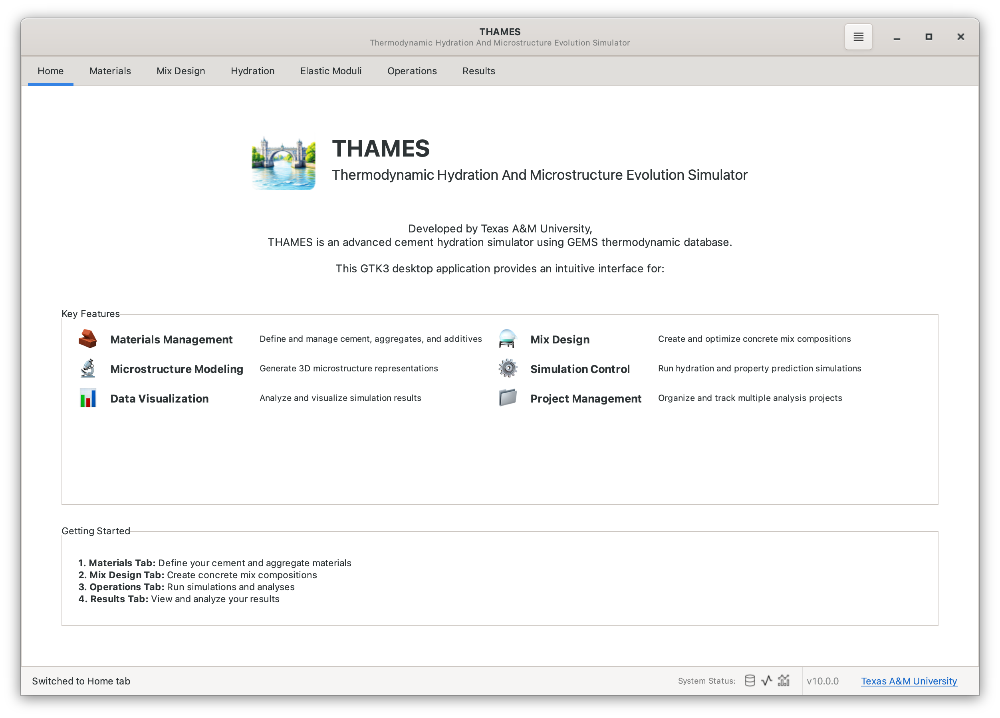
*Figure 3.1: THAMES main window showing the tab bar and Materials panel*

### 3.2 Tab Navigation

THAMES uses a tabbed interface with six main sections:

| Tab | Purpose |
|-----|---------|
| **Materials** | Create and manage cementitious materials |
| **Mix Design** | Define binder compositions, water content, and generate 3D microstructures |
| **Hydration** | Configure and run hydration simulations |
| **Elastic** | Compute elastic properties |
| **Operations** | Monitor running and completed operations |
| **Results** | View and analyze simulation output |

Navigation between tabs follows a typical workflow from left to right, though you can access any tab at any time.

### 3.3 Preferences

Access preferences via **THAMES → Preferences** (macOS) or **Edit → Preferences** (Windows).

#### General Tab

- **Auto-save**: Automatically save changes to the database
- **Confirm destructive actions**: Show confirmation dialogs before irreversible operations

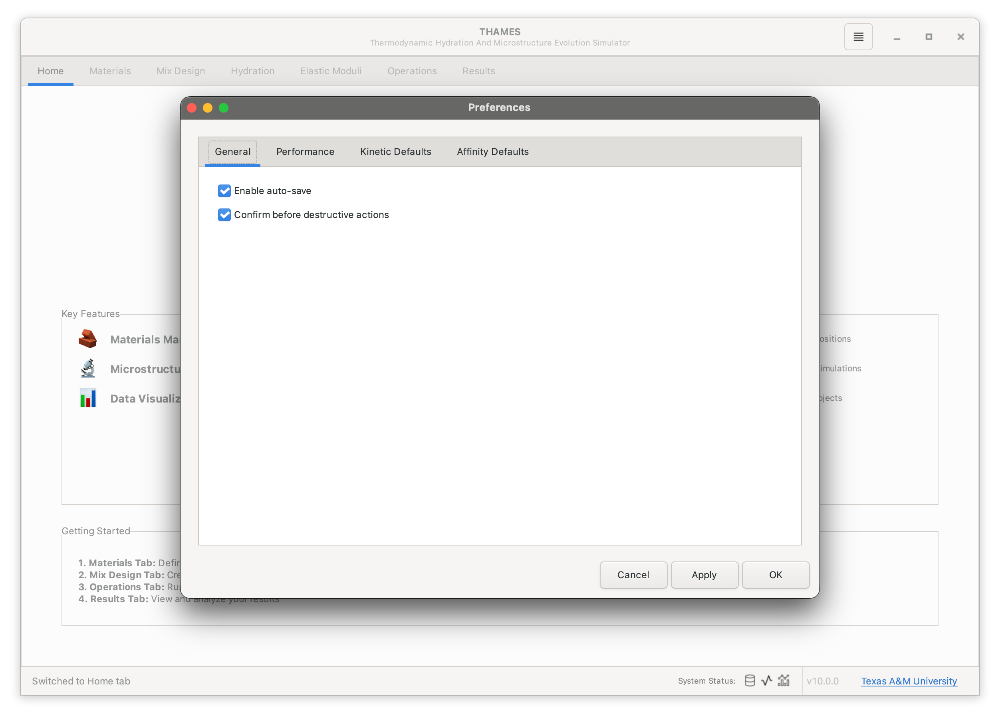
*Figure 3.2: Preferences dialog - General tab*

#### Performance Tab

Configure computational resources:

- **Worker threads**: Number of parallel threads for simulations
- **Memory limit**: Maximum memory allocation for operations
- **Enable caching**: Cache intermediate results for faster re-runs

#### Kinetic Defaults Tab

Configure default kinetic parameters for phases:

- Search for phases by name
- Edit Parrot-Killoh, Standard, or Pozzolanic parameters
- Reset to factory defaults
- Import/Export kinetic configurations

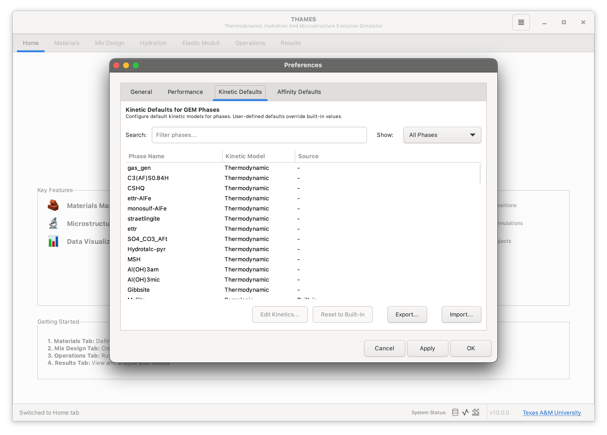
*Figure 3.3: Preferences dialog - Kinetic Defaults tab*

#### Affinity Defaults Tab

Configure default interface affinities between phases:

- Set affinity values that control how phases interact at interfaces
- Values range from 0 (no affinity) to 1 (maximum affinity)
- These defaults are used when setting up hydration simulations

---

## 4. Materials Management

### 4.1 Material Types

THAMES supports several material types:

| Type | Description | Typical Phases |
|------|-------------|----------------|
| **Clinker** | Portland cement clinker | C₃S, C₂S, C₃A, C₄AF |
| **Cement** | Ground clinker + gypsum | Clinker phases + sulfates |
| **SCM** | Supplementary cementitious materials | Quartz, mullite, glasses |
| **Limestone** | Ground limestone | Calcite |
| **Inert** | Non-reactive fillers | Quartz, aggregate |

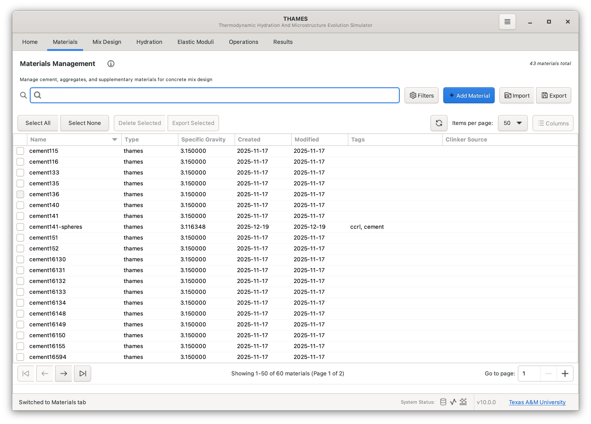
*Figure 4.1: Materials panel showing the list view with tag filters*

### 4.2 Creating Materials

To create a new material:

1. Click the **Add Material** button in the Materials panel
2. Enter a **Name** for the material
3. Add **Tags** (comma-separated) to categorize the material (e.g., "cement, type-i, portland")
4. Enter the **Specific Gravity** of the material (can be auto-calculated from phase composition)
5. Enter the **Specific Surface Area** in m²/kg (Blaine fineness)
6. Expand **Particle Size Distribution** to configure the PSD (see below)
7. Select the **Particle Shape**:
   - *Spheres*: Idealized spherical particles
   - *Real shapes*: Use digitized particle shape sets from actual powders
8. Select the **Material Type**:
   - *Simple Material*: Standard material with uniform properties
   - *Cement*: Clinker-based material with clinker fraction data
9. Optionally add a **Description**
10. Configure the **Phase Composition** (see below)
11. Click **Save**

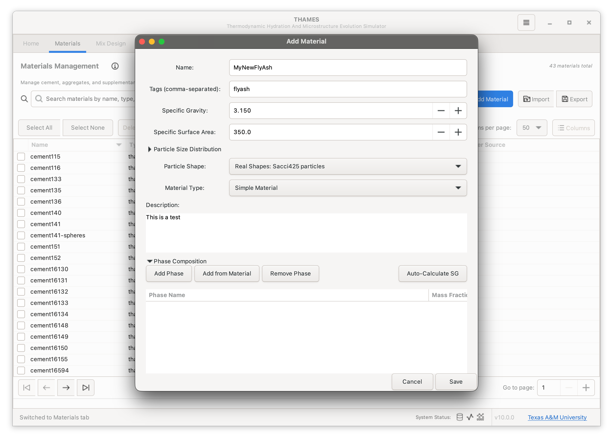
*Figure 4.2: Material dialog for creating or editing a material*

#### Particle Size Distributions

Each material can have its own particle size distribution (PSD). THAMES supports five PSD types:

**Rosin-Rammler**

```
F(d) = 1 - exp(-(d/d₀)ⁿ)
```

Parameters:
- **Characteristic diameter (d₀)**: μm
- **Shape parameter (n)**: dimensionless

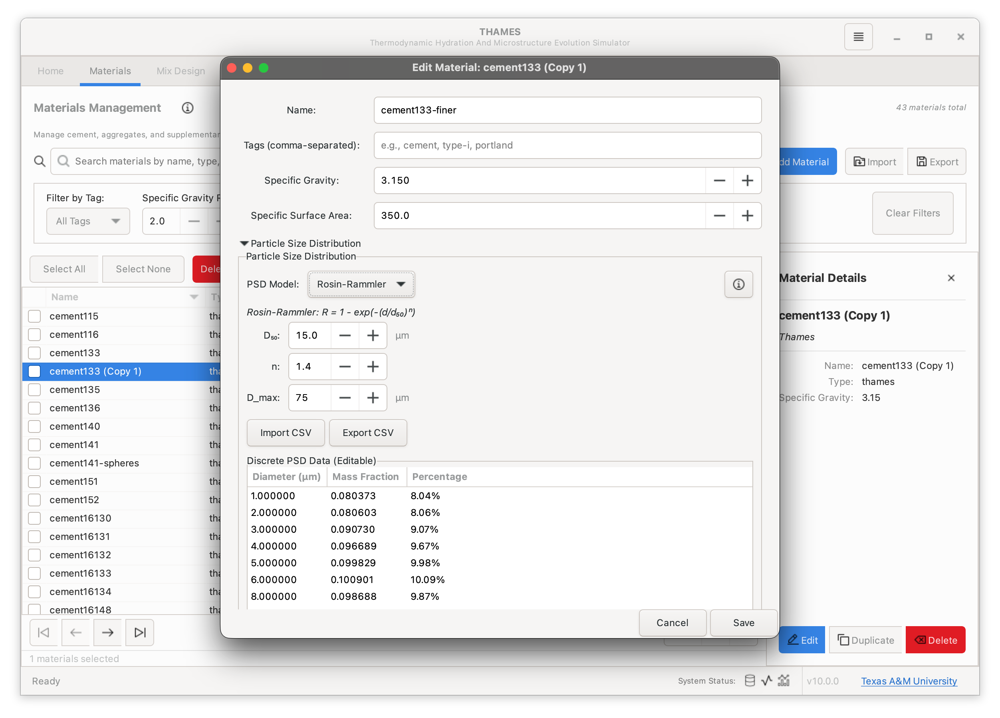
*Figure 4.3: Particle Size Distribution configuration (Rosin-Rammler mode)*

**Log-Normal**

```
F(d) = Φ((ln(d) - μ) / σ)
```

Parameters:
- **Mean (μ)**: ln(μm)
- **Standard deviation (σ)**: dimensionless

**Fuller-Thompson**

```
F(d) = (d/d_max)^n
```

Parameters:
- **Maximum diameter (d_max)**: μm
- **Exponent (n)**: typically 0.5

**Custom**

User-defined cumulative distribution:
- Enter pairs of (diameter, cumulative fraction)
- Linear interpolation between points

**Discrete**

Specific particle sizes with volume fractions:
- Enter pairs of (diameter, volume fraction)
- Must sum to 100%

### 4.3 Phase Composition Editor

The Phase Composition Editor allows you to define the mineralogical composition of a material:

#### Adding Phases

1. Click **Add Phase** to add individual phases
2. Or click **Add from Material** to copy phases from an existing material (useful for building cements from clinkers)

#### Phase Properties

For each phase, configure:

- **Phase name**: Select from the GEMS database (100 phases available)
- **Mass fraction**: Percentage by mass (must sum to ≤100%)
- **Kinetic model**: Thermodynamic (no dissolution), Parrot-Killoh, Standard, or Pozzolanic

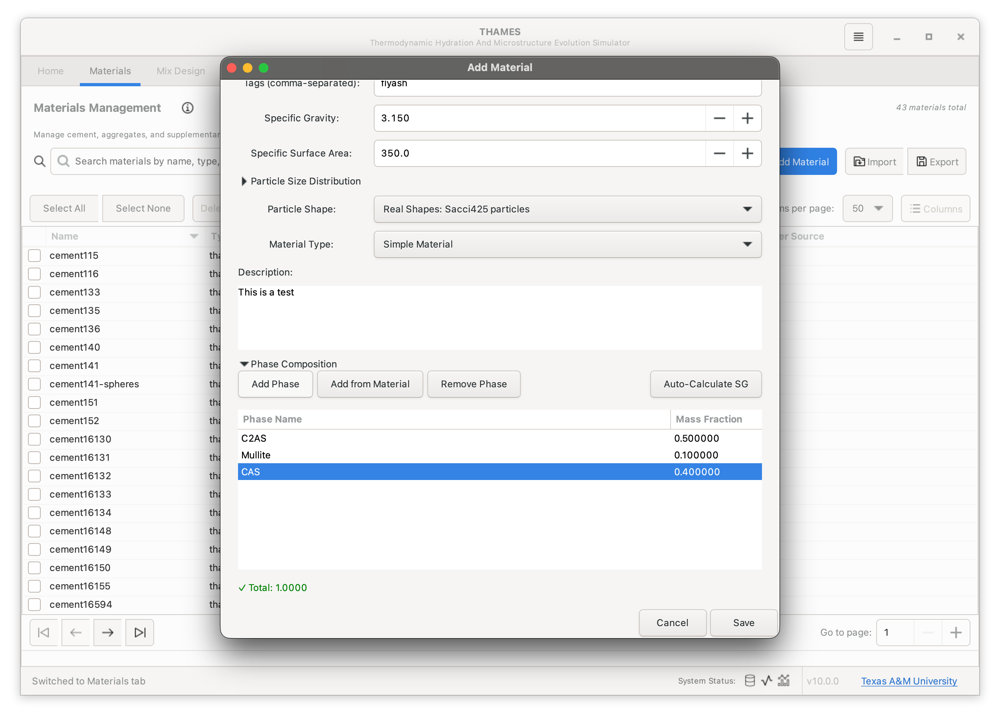
*Figure 4.4: Phase Composition Editor showing phases with mass fractions and kinetic models*

#### Clinker Phases

For clinker phases (C₃S, C₂S, C₃A, C₄AF), additional data is available:

- **Surface area fractions**: Distribution of phase surfaces
- **Correlation functions**: Spatial correlation data (stored as BLOBs)

### 4.4 Tags

Tags help organize materials:

- **Predefined tags**: OPC, Blended, SCM, Limestone, Custom
- **Custom tags**: Create your own organizational tags
- **Multi-select**: Materials can have multiple tags

Filter materials by tag using the tag selector in the Materials panel.

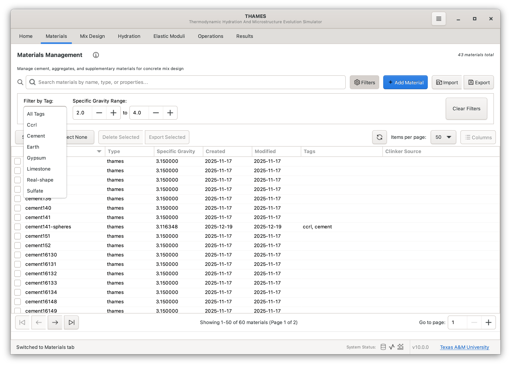
*Figure 4.5: Tag chip input for categorizing materials*

### 4.5 Importing and Exporting Materials

> **Note:** This feature is planned for a future release and is not yet available in the current version.

#### Export (Future)

1. Select a material in the list
2. Click **Export**
3. Choose a location and filename (`.json` format)

#### Import (Future)

1. Click **Import**
2. Select a `.json` material file
3. The material is added to your database

---

## 5. Mix Design

### 5.1 Creating a Mix Design

A mix design defines the proportions of materials in a cementitious binder:

1. Navigate to the **Mix Design** tab
2. Enter a **Name** for the mix
3. Click **Add Material** to include materials from your database
4. Set the **Mass Fraction** for each material (must sum to 100%)

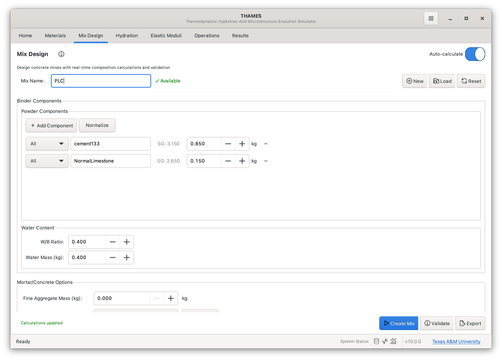
*Figure 5.1: Mix Design panel with material list and mass fractions*

### 5.2 Water-to-Binder Ratio

The water-to-binder (W/B) ratio determines:

- Initial porosity of the microstructure
- Available water for hydration
- Final porosity and strength

**Typical values:**
- Standard concrete: 0.40–0.50
- High-performance concrete: 0.30–0.40
- Dilute suspensions: Up to 10.0 (for research applications)

### 5.3 Aggregates

THAMES supports both fine and coarse aggregates in mix designs.

#### Aggregate Types

- **Fine Aggregate**: Sand-sized particles (typically < 4.75 mm)
- **Coarse Aggregate**: Gravel-sized particles (typically > 4.75 mm)

#### Configuring Aggregates

1. Select an aggregate material from the **Fine Aggregate** or **Coarse Aggregate** dropdown
2. Enter the **Mass** of aggregate in the mix
3. Select a **Shape Set** for each aggregate (see below)
4. Click the **Grading** button to configure the particle size grading

#### Aggregate Shape Sets

Each aggregate has an associated shape set — a library of 3D particle geometries (represented as spherical-harmonic coefficients) that the microstructure generator uses to place realistic particles.

- **Fine aggregate shapes**: sands and fine manufactured aggregates (e.g., MA106A-1-fine, Ottawa-sand, SiamSand, Cubic, spheres)
- **Coarse aggregate shapes**: gravels, crushed stone, and manufactured coarse aggregates (e.g., GR-coarse, AZ-coarse, FDOT-57, Cubic, spheres, Slab)

The shape set affects the generated microstructure geometry and — through that geometry — the elastic moduli calculation. When in doubt, `spheres` is a safe default for exploratory runs; named sets derived from real aggregates give more realistic geometry for elastic predictions.

Shape data is bundled with the application as `aggregate.tar.gz` and is automatically extracted to the user data directory on first launch.

#### Aggregate Grading

The grading curve defines the particle size distribution of the aggregate:

- Select from predefined grading templates (ASTM standards)
- Or create a custom grading curve by entering sieve sizes and percent passing
- The grading curve is displayed graphically for verification

### 5.4 Microstructure Configuration

Before generating a microstructure, configure the following options:

#### Dimensions

- **X, Y, Z dimensions**: Number of voxels in each direction
- **Typical values**: 100³ for testing, 200³ for production

#### Resolution

- **Voxel size**: μm per voxel edge
- **Default**: 1.0 μm
- **Range**: 0.25–4.0 μm

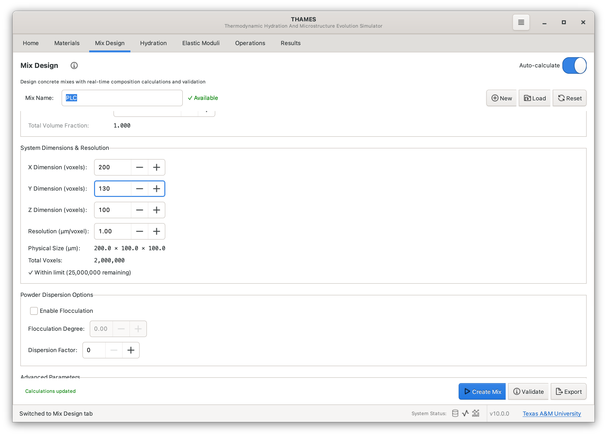
*Figure 5.2: Microstructure generation configuration panel*

### 5.5 Resolution and Dimensions

The relationship between resolution and physical size:

```
Physical size = Dimensions × Resolution
```

**Example**: 200 × 200 × 200 voxels at 1.0 μm = 200 × 200 × 200 μm = 0.2 mm cube

**Memory considerations:**

| Dimensions | Voxels | Approximate RAM |
|------------|--------|-----------------|
| 100³ | 1 million | ~100 MB |
| 150³ | 3.4 million | ~350 MB |
| 200³ | 8 million | ~800 MB |
| 300³ | 27 million | ~2.7 GB |

### 5.6 Running Microstructure Generation

1. Configure all options
2. Click **Generate Microstructure**
3. Monitor progress in the Operations tab
4. Generation typically takes 1–10 minutes depending on size

The generator creates particles matching:
- The specified PSD for each material
- The target volume fraction based on W/B ratio
- Realistic particle shapes from the shape set library

### 5.7 Viewing Generated Microstructures

After generation completes:

1. Navigate to the **Results** tab
2. Select the microstructure operation
3. Use the 3D viewer to inspect:
   - Rotate: Click and drag
   - Zoom: Scroll wheel
   - Pan: Right-click and drag
   - Slice planes: Use the slice controls


*Figure 5.3: 3D view of a generated cement particle microstructure*

---

## 6. Hydration Simulation

### 6.1 Simulation Setup

To configure a hydration simulation, navigate to the **Hydration** tab. At the top of the panel, choose one of two input modes:

#### New Simulation from Microstructure

Select this radio button to start a fresh simulation from a completed microstructure.

1. Pick a microstructure from the **Microstructure** dropdown (must be previously generated)
2. Use the refresh button next to the dropdown if a newly generated microstructure does not appear
3. The info line below the dropdown confirms the selected microstructure's size, resolution, and mix design

#### Load from Previous Hydration Operation

Select this radio button to pre-fill all simulation parameters from a previous run. Use this when you want to re-run a simulation with small tweaks, or reproduce a prior study with a different microstructure size.

1. Pick a prior operation from the **Operation** dropdown — the list is populated from every `*_hydration_config.json` file in the operations directory
2. All Hydration panel widgets (temperature, moisture condition, electrolyte, products, kinetic parameters, time parameters, adaptive stepping, suppressed phases, runtime options) are loaded from the chosen config
3. Edit any field before re-running

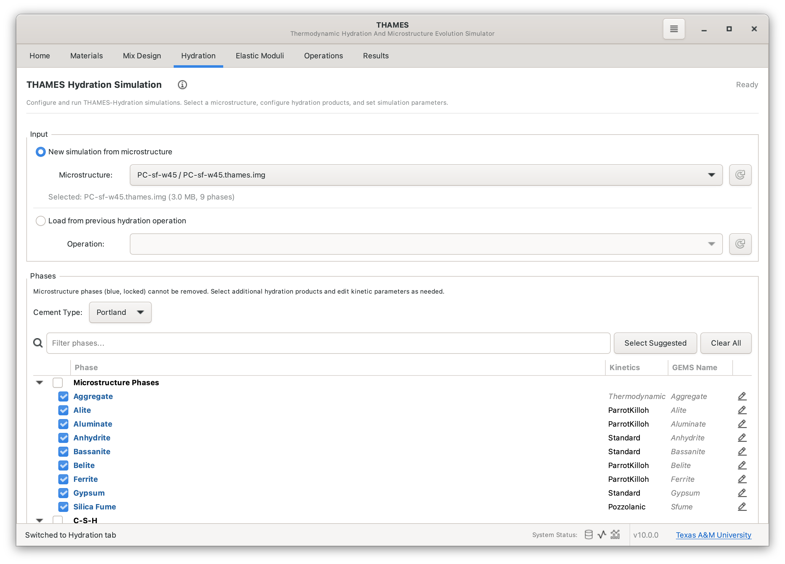
*Figure 6.1a: Input mode selection with "New simulation" and "Load from previous hydration operation" radio buttons*

#### Temperature

- **Default**: 25°C (298.15 K)
- **Range**: 4–80°C (277–353 K)
- Temperature affects both kinetics (Arrhenius) and thermodynamics (GEMS)

#### Moisture Condition

- **Saturated**: Unlimited water supply (typical for paste in water)
- **Sealed**: Fixed water content (typical for real concrete)

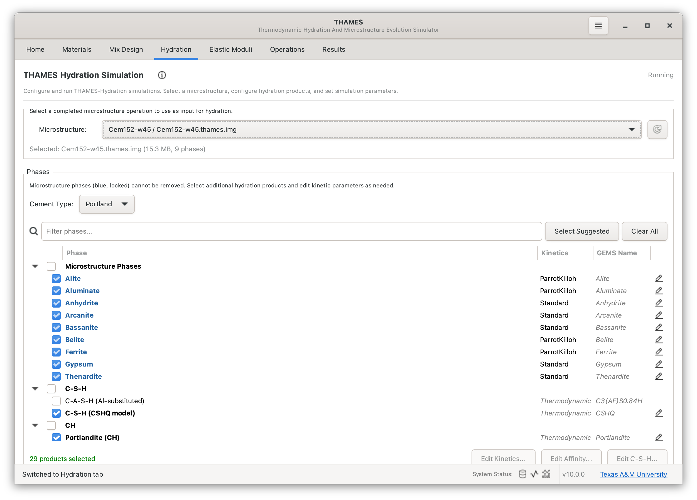
*Figure 6.1b: Hydration panel showing microstructure selection and simulation parameters*

### 6.2 Kinetic Models

THAMES supports three kinetic model types:

#### Parrot-Killoh (Clinker Phases)

For C₃S, C₂S, C₃A, and C₄AF:

| Parameter | Description | Units |
|-----------|-------------|-------|
| k₁ | Nucleation/growth rate | dimensionless |
| k₂ | Early diffusion rate | dimensionless |
| k₃ | Late diffusion rate | dimensionless |
| n₁ | Nucleation exponent | dimensionless |
| n₃ | Late diffusion exponent | dimensionless |
| E_a | Activation energy | J/mol |
| DOR_H | Critical degree of reaction | dimensionless |

#### Standard (Sulfate Phases)

For gypsum, hemihydrate, anhydrite:

| Parameter | Description | Units |
|-----------|-------------|-------|
| k | Dissolution rate constant | mol/m²/s |
| E_a | Activation energy | J/mol |
| SI_exp | Saturation index exponent | dimensionless |
| DOR_exp | Degree of reaction exponent | dimensionless |

#### Pozzolanic (SCM Phases)

For silica fume, fly ash glasses, slag:

| Parameter | Description | Units |
|-----------|-------------|-------|
| k | Dissolution rate constant | mol/m²/s |
| E_a | Activation energy | J/mol |
| OH_exp | Hydroxyl activity exponent | dimensionless |
| SiO₂ | Silicon dioxide content | mass fraction |

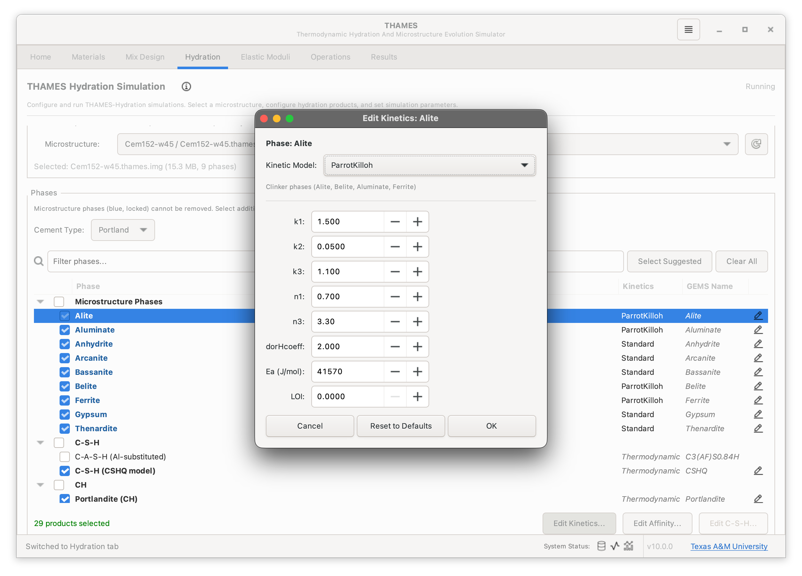
*Figure 6.2: Kinetic model editor showing Parrot-Killoh parameters for a clinker phase*

### 6.3 Electrolyte Composition

The electrolyte (pore solution) composition can be configured:

#### Initial Conditions

Species set at simulation start but allowed to evolve:
- K⁺, Na⁺, Ca²⁺, SO₄²⁻, OH⁻, etc.

#### Fixed Conditions

Species maintained at constant concentration:
- Useful for simulating exposure to external solutions

#### Attack Conditions

Species that increase over time:
- Used for sulfate attack or chloride ingress simulations

The **Charge Balance** indicator shows whether the solution is electrically neutral (required for GEMS calculations).

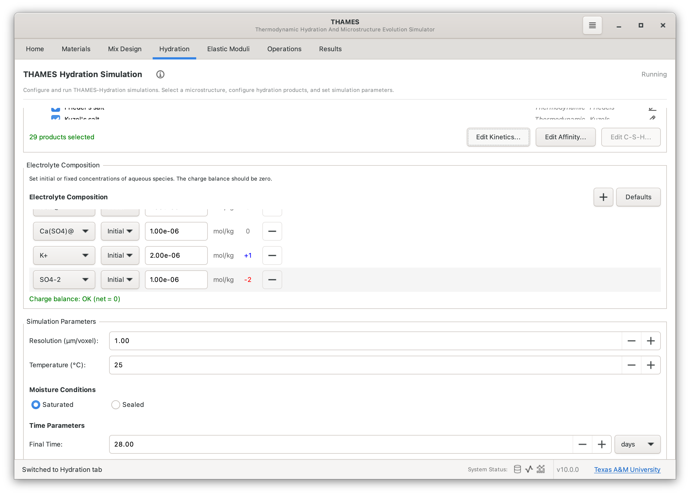
*Figure 6.3: Electrolyte Composition Editor with species list and charge balance indicator*

### 6.4 Hydration Products

Select which hydration products can precipitate:

#### Categories

- **Calcium hydroxide**: Portlandite (CH)
- **C-S-H phases**: CSHQ model with Jennings/Tobermorite end members
- **AFt phases**: Ettringite, thaumasite
- **AFm phases**: Monosulfate, hemicarbonate, monocarbonate, etc.
- **Carbonates**: Calcite, aragonite, vaterite
- **Hydrotalcites**: Mg-Al layered double hydroxides
- **Zeolites**: For advanced pozzolanic systems

Enable/disable entire categories or individual phases.

#### Suppressing Phases

Unchecking a phase in the products tree does more than hide it from the UI — it adds the phase to a `suppressed_phases` list written into `simparams.json`. At runtime, the controller maps each suppressed phase to its GEMS dependent components (DCs) and applies a zero upper bound so GEMS cannot precipitate them at any step.

Use suppression to exclude phases that are thermodynamically stable but known to be kinetically inhibited in your system (for example, metastable polymorphs, or carbonates in a carbonation-free experiment). Microstructure phases shown in blue are locked and cannot be suppressed.

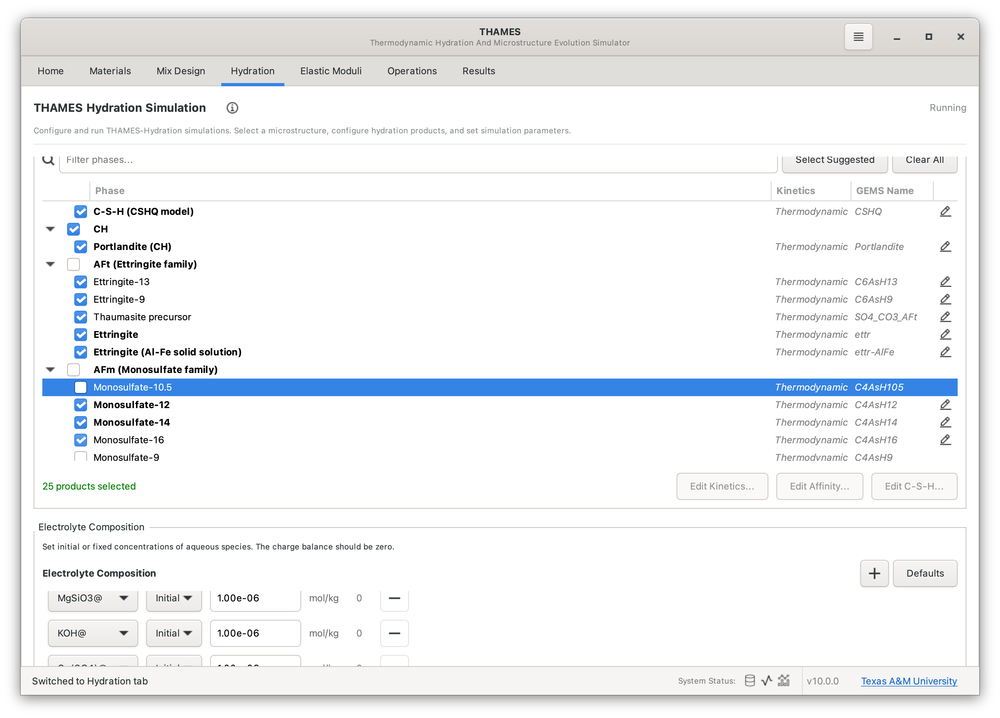
*Figure 6.4: Hydration products tree with category checkboxes and phase selection*

### 6.5 Time Parameters

#### Final Simulation Time

- **Units**: Seconds, minutes, hours, or days (selectable from the unit combo next to the value)
- **Typical values**: 28 days for standard characterization, up to 1 year for long-term durability studies

#### Output Times

Control when microstructure snapshots are saved:

- **Spacing**: Time interval between outputs (seconds, minutes, hours, or days)
- **Preview**: Shows the number of output times that will be generated
- Snapshot file names include seconds, e.g., `00d00h00m18s`, so that sub-minute outputs are distinguishable

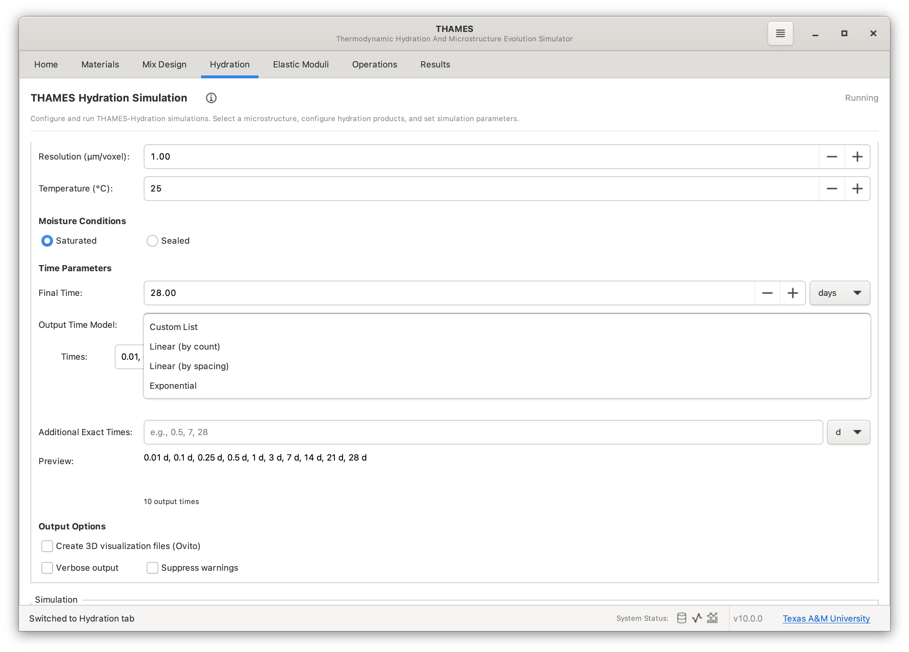
*Figure 6.5: Time parameters configuration with output time preview*

#### Adaptive Time Stepping

THAMES adjusts the simulation time step dynamically to balance accuracy, stability, and speed. The controller grows the step after consecutive GEMS successes and shrinks it after failures, always respecting a kinetics-based physics limit.

Enable or disable adaptive stepping with the **Enable adaptive time stepping** checkbox at the top of the section. When disabled, the simulation uses the fixed output-spacing as its time step. Most users should leave adaptive stepping enabled.

Click **Advanced Parameters** to expose the seven tunable parameters:

| Parameter | Default | Description |
|-----------|---------|-------------|
| Initial time step | 3.6 s (0.001 h) | First step attempted after the induction period |
| Maximum time step | 4.0 h | Upper bound on any step, regardless of success history |
| Growth factor | 1.5 | Multiplier applied after consecutive successes |
| Shrink factor | 0.5 | Multiplier applied after a GEMS failure |
| Successes before growth | 2 | Consecutive successes required before growing the step |
| Max consecutive failures | 50 | Simulation terminates after this many consecutive GEMS failures |
| Max relative change per step | 0.05 (5%) | Kinetics constraint: maximum fractional change in any DC's moles per step |

Both **Initial time step** and **Maximum time step** have their own unit combo (seconds / minutes / hours); internally, values are stored in hours.

**When to tune:**
- Lower **Max relative change** (e.g., 0.02) for stiff systems that oscillate or fail frequently
- Raise **Maximum time step** only for very long (months to years) simulations where late-age evolution is slow
- Lower **Growth factor** (e.g., 1.2) for conservative pacing if you see late-stage instabilities
- Raise **Successes before growth** (e.g., 5) to pace more cautiously after recovery from failures

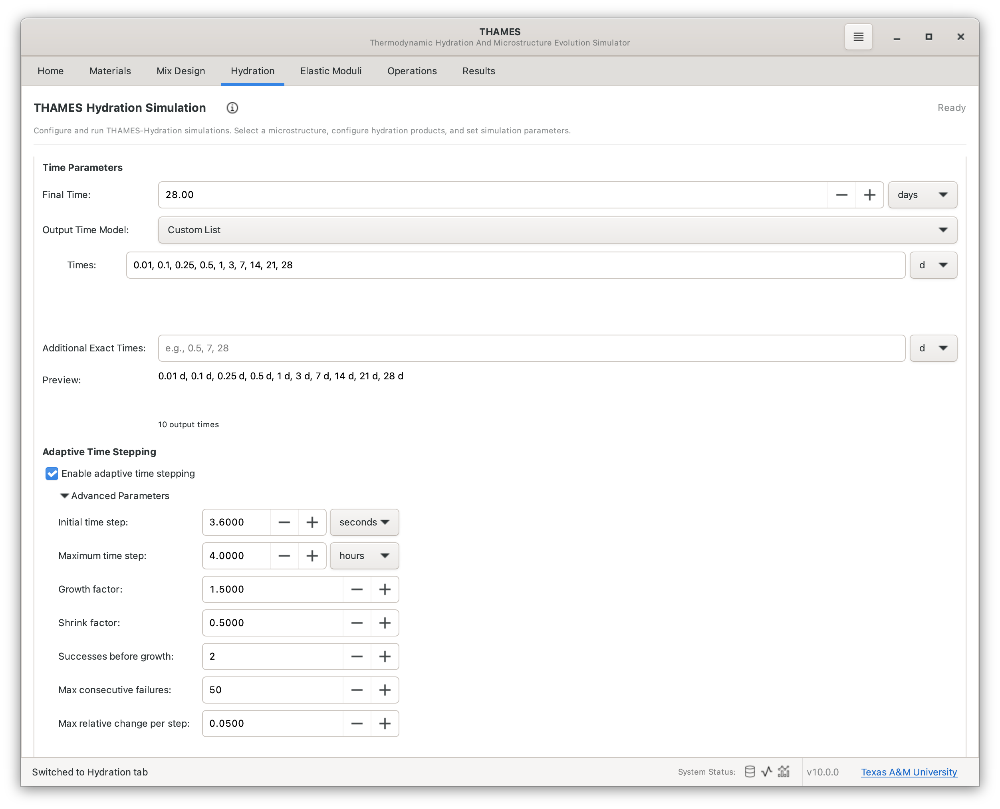
*Figure 6.5b: Adaptive time stepping section with advanced parameters expanded*

#### Runtime Safety Options

Two runtime safeguards are surfaced in the Hydration panel:

- **IC floor and charge compensation**: If an independent component (IC) is driven toward depletion, THAMES injects a minimum amount (controlled internally by `IC_FLOOR = 1e-5`) and compensates the charge balance. This prevents GEMS failures from trace-element exhaustion.
- **Electrolyte concentration overrides**: If the initial electrolyte concentrations are low enough that the IC floor would be breached at step 1, THAMES raises those concentrations to a safe minimum and records the change in `concentration_overrides.json`. The Operations panel displays a notification when this occurs so the override is visible to the user.

### 6.6 Running Simulations

1. Click **Start Hydration**
2. Monitor progress in the Operations tab
3. Progress shows:
   - Current cycle number
   - Simulated time
   - Degree of hydration (DOH)

**Simulation time varies based on:**
- Microstructure size (larger = slower)
- Simulation duration (longer = more cycles)
- System complexity (more phases = more GEMS time)

**Typical times:**
- 100³ voxels, 28 days: 30–60 minutes
- 200³ voxels, 28 days: 2–4 hours

---

## 7. Elastic Properties

THAMES computes elastic moduli in up to three scales depending on what the microstructure contains:

1. **Binder (paste) scale** — always computed. A voxel-level finite-element solve on the paste microstructure returns the effective bulk, shear, and Young's moduli and Poisson's ratio of the hydrated paste.
2. **ITZ scale** — computed automatically when the microstructure contains an aggregate slab. The FEM solver additionally records K and G averaged over planes parallel to the slab, giving a profile from the aggregate surface outward that captures the softened interfacial transition zone (ITZ).
3. **Concrete scale** — computed when aggregate data is present. The paste + ITZ profile is homogenized with the aggregate grading, volume fraction, and intrinsic moduli (*concelas* post-processing) to give concrete-scale effective moduli and empirical compressive strength fits.

### 7.1 Configuration

To calculate elastic properties:

1. Navigate to the **Elastic** tab
2. Select a completed hydration operation
3. Select a specific microstructure time point
4. Configure calculation parameters:
   - **Number of loading directions**: 3 minimum, 6 recommended
   - **Convergence tolerance**: Default 1×10⁻⁶

When the parent hydration operation was run on a microstructure that contains a one-voxel aggregate slab, the panel auto-populates the **Aggregate Properties** section from the mix-design lineage (fine and/or coarse volume fraction, bulk modulus, shear modulus, and grading template) and auto-checks the **Include ITZ** checkbox. If lineage returns a zero volume fraction for an aggregate whose name is set, the Source label displays a red warning — this indicates the microstructure has no aggregate slab (most commonly because `fine_aggregate_mass` or `coarse_aggregate_mass` was left at 0 in Mix Design).

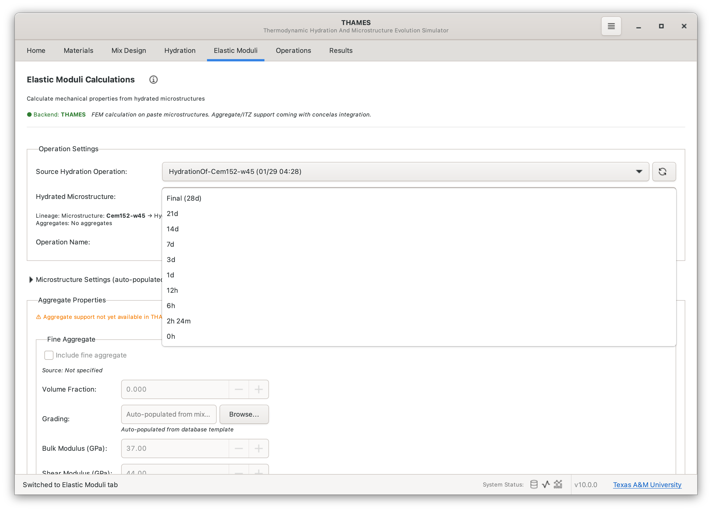
*Figure 7.1: Elastic properties panel with hydration selection and microstructure time point*

### 7.2 Running Elastic Calculations

1. Click **Calculate**
2. The calculation applies virtual strains and measures stresses
3. Progress is shown in the Operations tab
4. Calculation takes 5–30 minutes for a 100³ microstructure; 2–4 hours for 200³

When ITZ is enabled and aggregate data is present, `concelas_inputs.json` is written to the operation directory at launch. After the finite-element solver finishes, the concelas post-processor reads it and appends concrete-scale moduli and strengths to `EffectiveModuli.csv`. A `ConcelasLog.txt` is written alongside the CSV for debugging.

### 7.3 Viewing Results

Open the **Effective Moduli Viewer** to see the numerical results grouped into sections. For a paste-only run only the binder section is populated; for an aggregate-bearing run all four sections appear.

#### Binder Effective Moduli (always present)

- **Bulk modulus (K)**: Resistance to compression, GPa
- **Shear modulus (G)**: Resistance to shear, GPa
- **Young's modulus (E)**: Stiffness, GPa
- **Poisson's ratio (ν)**: Lateral strain ratio

These come from the paste-scale FEM and represent the hydrated paste as a single homogeneous composite.

#### Concrete Properties (when aggregate present)

Volume fractions:
- **Concrete aggregate fraction**: Total aggregate volume in the concrete
- **Concrete air fraction**: Entrained air volume fraction
- **Concrete matrix fraction**: Paste volume fraction (1 − aggregate − air)

Moduli (multi-scale homogenization from paste + ITZ + grading + aggregate intrinsic moduli):
- **Concrete bulk modulus**, **shear modulus**, **Young's modulus**, **Poisson's ratio** (GPa)

Empirical compressive strengths (power-law fits of E<sub>concrete</sub>):
- **Mortar cube strength** (MPa): fit from SCG mortars, 2013 revision
- **Concrete cube strength** (MPa): fit from Pichet (SCG/SRI), 2013 revision
- **Concrete cylinder strength** (MPa): 0.624 × cube strength

These strength fits are empirical — use them as indicators, not as replacements for laboratory testing.

#### ITZ Properties (when aggregate present)

- **ITZ bulk modulus** and **ITZ shear modulus** (GPa): averaged over a voxel-thick shell of width equal to the median cement particle diameter, immediately adjacent to the aggregate surface
- **ITZ width** (μm): auto-derived from the cement PSD's d₅₀

The ITZ is typically softer than the bulk paste (often by 20–40%) because the aggregate surface disrupts cement packing and creates a locally high-porosity region. You will see this directly as K<sub>ITZ</sub> < K<sub>paste</sub> in the table.

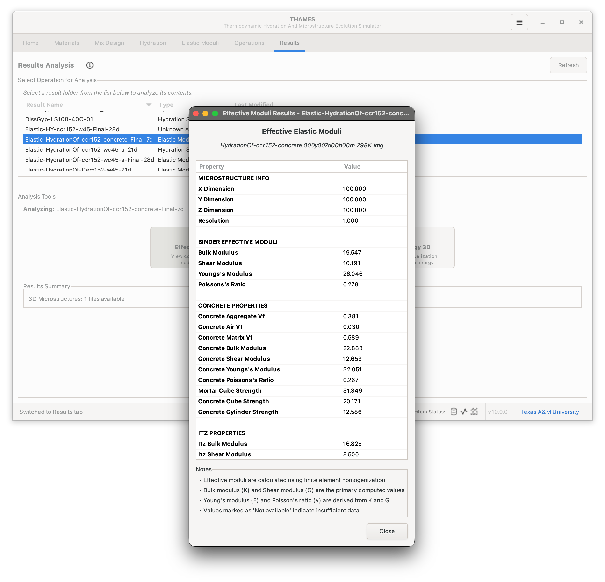
*Figure 7.3a: Effective Moduli Viewer for an aggregate-bearing 7-day mortar. Four sections are visible: MICROSTRUCTURE INFO, BINDER EFFECTIVE MODULI (paste K, G, E, ν), CONCRETE PROPERTIES (volume fractions, concrete K, G, E, ν, and strength fits), and ITZ PROPERTIES (K, G, and width). A paste-only run shows only the binder section.*

#### ITZ Profile Plot

The `ITZModuli.csv` file written by the FEM contains K, G, E, and ν averaged over voxel-thick layers at successively larger distances from the aggregate surface. Plotting these as a function of distance shows the softening-with-distance signature of the ITZ and its transition into bulk paste.

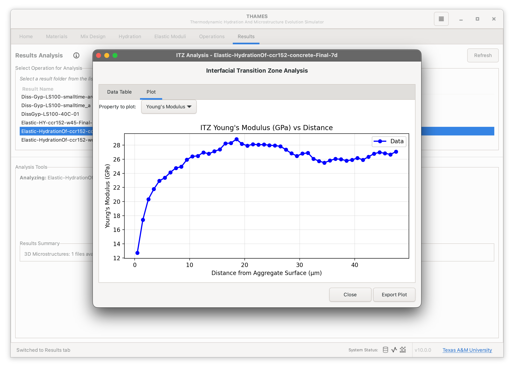
*Figure 7.3b: ITZ property profile as a function of distance from the aggregate surface. The leftmost layers (< ~10 μm) are the ITZ proper; values stabilize at the bulk-paste moduli beyond that range.*

#### Strain Energy

3D visualization of strain energy density:
- Identifies stress concentrations
- Shows load paths through the microstructure

---

## 8. Operations Monitoring

### 8.1 Operation States

Operations progress through states:

| State | Description |
|-------|-------------|
| **Pending** | Queued, not yet started |
| **Running** | Currently executing |
| **Completed** | Finished successfully |
| **Failed** | Encountered an error |
| **Cancelled** | Stopped by user |

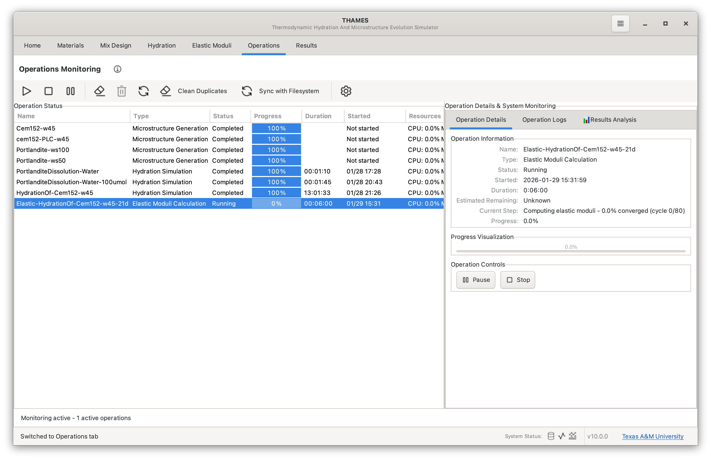
*Figure 8.1: Operations panel showing different operation states*

> **⚠️ Alpha limitation: closing THAMES while an operation is running**
>
> If you close (or crash) the THAMES application while a Mix or Hydration
> operation is running, the simulator process (`micgen.exe` /
> `thames.exe`) keeps running in the background and continues to write
> output. **However, the next time you launch THAMES it cannot tell that
> the simulator is still alive**, and will display the operation as
> *Cancelled*. The simulator process itself is unaffected — it will run
> to completion and the output folder under
> `%LOCALAPPDATA%\THAMES\operations\<name>\` (macOS:
> `~/Library/Application Support/THAMES/operations/<name>/`) will contain
> the final result files when it finishes.
>
> **What to do if this happens:**
> 1. **Do not delete the "Cancelled" operation from the panel yet.** Use
>    Task Manager (Windows) or Activity Monitor / `ps aux | grep` (macOS)
>    to check whether `micgen.exe` / `thames.exe` is still alive.
> 2. If it's alive, wait for it to finish. The output folder is
>    authoritative — once the .img and CSV files are present, the run is
>    complete regardless of what the Operations panel says.
> 3. The Results panel scans the operations folder directly, so a
>    finished run is visible there even if the Operations panel still
>    labels it "Cancelled."
>
> **What to do to avoid it:**
> - Use the operation's *Stop* button before closing THAMES if you want
>   to actually cancel the run.
> - If you want the run to keep going, simply leave THAMES open until it
>   completes. THAMES does not need to be foregrounded; you can minimize
>   the window and use other applications.
>
> Reattaching to live operations across app restarts is on the post-alpha
> roadmap.

### 8.2 Progress Tracking

For hydration simulations, progress displays:

```
Cycle 1250, Time: 15.50d of 28.0d, DOH: 0.678
```

- **Cycle**: Simulation iteration number
- **Time**: Simulated time and target
- **DOH**: Degree of hydration (0.0–1.0)

Time units adapt automatically:
- Minutes for simulations < 1 hour
- Hours for simulations < 24 hours
- Days for simulations ≥ 24 hours

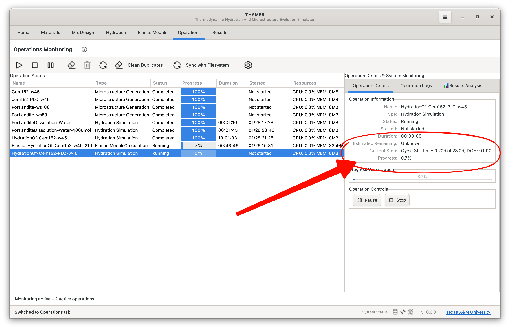
*Figure 8.2: Hydration simulation progress showing cycle, time, and DOH*

### 8.3 Viewing Operation Details

Click on an operation to view:

- **Parameters**: Input configuration
- **Output files**: Generated files and their locations
- **Logs**: Detailed execution logs
- **Errors**: Any error messages

### 8.4 Runtime Alerts

The Operations panel surfaces non-fatal runtime events that change the simulation state from what was configured in the UI.

#### Exit Status Alerts

Hydration runs write an `exit_status.json` file on termination. When an operation ends abnormally (GEMS solver unrecoverable, consecutive-failure limit reached, IC depletion unrecoverable, early final-time detection), the Operations panel raises an alert on the operation's status with the reason recorded in `exit_status.json`. A normal end-of-simulation exit does not raise an alert.

#### Concentration Override Notifications

If the IC-floor safety raised any initial electrolyte concentrations (see Section 6.5), a notification appears with a pointer to `concentration_overrides.json` in the operation directory. The file lists each species that was raised, the requested concentration, and the applied concentration. Review these before trusting the early-age chemistry of the run.

---

## 9. Results Analysis

### 9.1 3D Visualization

The 3D viewer provides:

#### Navigation

- **Rotate**: Left-click and drag
- **Zoom**: Scroll wheel or pinch
- **Pan**: Right-click and drag
- **Reset view**: Press 'R' or click Reset button

#### Orientation Axes

Corner axes indicator shows current view orientation (X, Y, Z with RGB colors).


*Figure 9.1: 3D viewer showing orientation axes indicator in corner*

#### Slice Planes

- Enable X, Y, or Z slice planes
- Adjust position with sliders
- View internal structure without obstruction

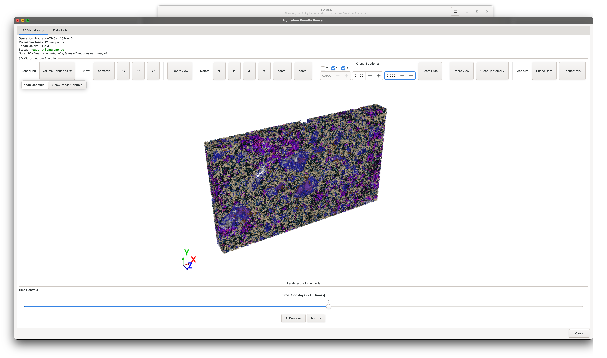
*Figure 9.2: 3D viewer with slice plane showing internal microstructure*

#### Phase Visibility

- Toggle individual phase visibility
- Adjust phase opacity (0–100%)
- Color scheme follows GEMS phase colors

### 9.2 Data Plots

The Data Plots tab provides time-series visualization:

#### Available Data

| File | Contents |
|------|----------|
| Phase Volumes | Volume fraction of each phase over time |
| Solution Chemistry | Ionic concentrations in pore solution |
| Saturation Indices | SI for all phases vs. time |
| Surface Areas | Phase-specific surface areas |
| Degree of Reaction | Individual phase reaction progress |
| Porosity | Total and capillary porosity |

#### Plot Options

- **Multi-select**: Plot multiple variables simultaneously
- **Time Units**: Select display units for the x-axis (Days, Hours, or Minutes)
- **Axes**: Linear or logarithmic scales
- **Range**: Auto or manual axis limits
- **Style**: Line width, marker style
- **Colors**: Automatic or custom color scheme

#### Multi-Simulation Comparison

Compare results from multiple hydration simulations on the same plot:

1. Click **Add...** in the "Compare with Simulations" section
2. Select another hydration operation from the list
3. The comparison simulation appears in the list below
4. Create a plot - data from all simulations will be shown together

**Comparison plot features:**
- Primary simulation uses solid lines
- Comparison simulations use different line styles (dashed, dash-dot, dotted)
- Same colors are used for the same variable across simulations
- Legend entries include simulation names in parentheses for identification

To remove a comparison simulation, select it in the list and click **Remove**.

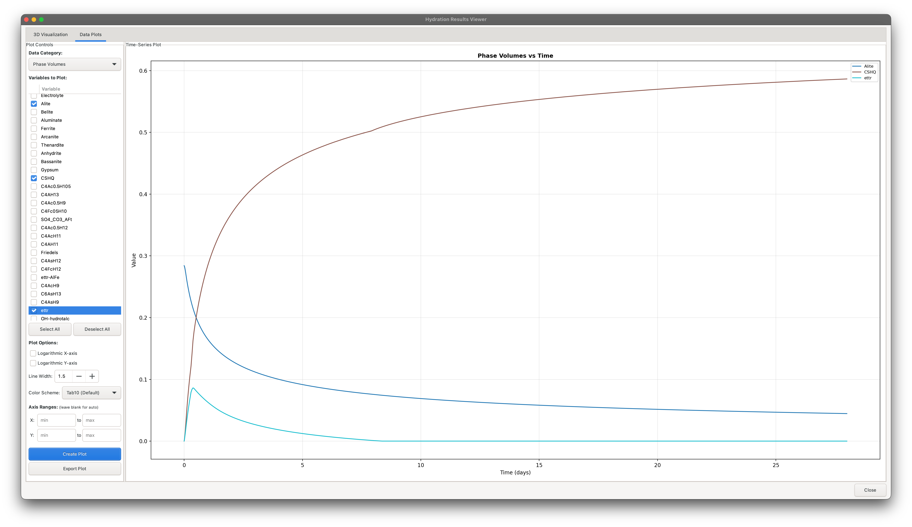
*Figure 9.3: Data plots showing phase volumes over time*

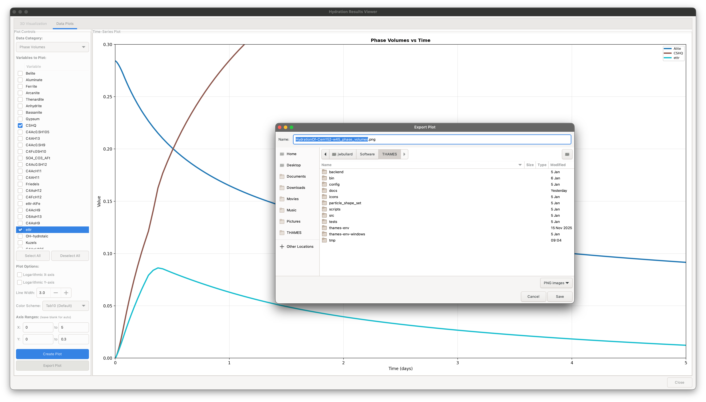
*Figure 9.4: Plot options panel with time unit selection and comparison simulations*

### 9.3 Exporting Results

#### Export Plots

- **PNG**: Raster image for presentations
- **PDF**: Vector format for publications
- **SVG**: Editable vector format

#### Export Data

- CSV files are already in the results folder
- Additional processing can be done with external tools (Python, Excel, etc.)

---

## 10. Workflows

### 10.1 Basic Portland Cement Hydration

**Goal**: Simulate 28 days of hydration for an ordinary Portland cement paste.

**Steps**:

1. **Create or select cement material**
   - Navigate to Materials tab
   - Select a cement (e.g., "Cem151") or create new
   - Verify phase composition: C₃S ~60%, C₂S ~15%, C₃A ~8%, C₄AF ~10%, gypsum ~5%

2. **Create mix design**
   - Navigate to Mix Design tab
   - Click "New Mix Design"
   - Add the cement at 100% mass fraction
   - Set W/B ratio to 0.45
   - Configure PSD (e.g., Rosin-Rammler with d₀=15 μm, n=1.0)

3. **Generate microstructure**
   - Navigate to Microstructure tab
   - Select the mix design
   - Set dimensions to 100 × 100 × 100
   - Set resolution to 1.0 μm
   - Click "Generate"
   - Wait for completion (~2–5 minutes)

4. **Configure hydration**
   - Navigate to Hydration tab
   - Select the generated microstructure
   - Set temperature to 25°C
   - Set moisture condition to "Saturated"
   - Set final time to 28 days
   - Enable desired hydration products (defaults are usually fine)

5. **Run simulation**
   - Click "Start Hydration"
   - Monitor progress in Operations tab
   - Wait for completion (~30–60 minutes)

6. **Analyze results**
   - Navigate to Results tab
   - View 3D microstructure evolution
   - Plot phase volumes vs. time
   - Export data as needed


*Figure 10.1a: 3D view of the hydrated paste microstructure at late age. C–S–H, Portlandite, and residual clinker are the dominant visible phases.*

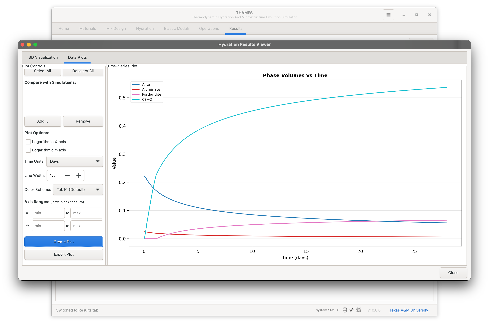
*Figure 10.1b: Phase volume fractions vs. time for the basic OPC workflow. The characteristic induction, acceleration, and deceleration stages of C₃S hydration are visible.*

### 10.2 Blended Cement with Fly Ash

**Goal**: Simulate hydration of a cement-fly ash blend (70:30).

**Steps**:

1. **Ensure materials exist**
   - Portland cement in database
   - Fly ash with appropriate phase composition (quartz, mullite, glass)

2. **Create blended mix design**
   - New mix design named "OPC-FA-30"
   - Add cement at 70% mass fraction
   - Add fly ash at 30% mass fraction
   - Set W/B ratio to 0.50 (higher for workability)
   - Configure PSDs for each material

3. **Generate microstructure**
   - Dimensions: 150 × 150 × 150 (larger to capture fly ash particles)
   - Resolution: 1.0 μm

4. **Configure hydration**
   - Temperature: 25°C
   - Duration: 90 days (pozzolanic reactions are slow)
   - Ensure pozzolanic products are enabled (CSHQ, additional AFm phases)

5. **Run and analyze**
   - Monitor fly ash reaction progress
   - Compare C-S-H volume to plain cement
   - Observe Ca/Si ratio evolution


*Figure 10.2: Blended cement microstructure showing cement and fly ash particles*

### 10.3 Computing Elastic Properties

**Goal**: Calculate elastic modulus evolution during hydration.

**Steps**:

1. **Run hydration simulation with frequent outputs**
   - Set output spacing to capture key ages (1h, 6h, 12h, 1d, 3d, 7d, 14d, 28d)

2. **After hydration completes**
   - Navigate to Elastic tab
   - Select the hydration operation

3. **For each time point of interest**
   - Select the microstructure snapshot
   - Click "Calculate"
   - Wait for completion (~10–20 minutes per calculation)

4. **Compile results**
   - Plot Young's modulus vs. time
   - Compare to experimental data
   - Note the effect of phase assemblage on properties

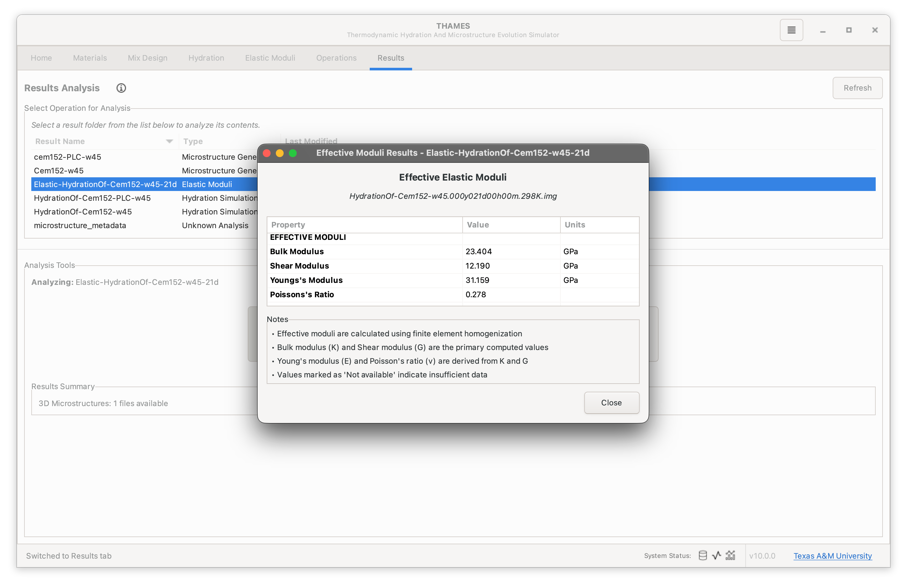
*Figure 10.3: Young's modulus evolution during hydration*

---

## 11. Troubleshooting

### 11.1 Common Issues

#### Application won't start

**macOS**:
- Right-click app, select "Open" to bypass Gatekeeper
- Check Console.app for error messages

**Windows**:
- Run as administrator
- Check Windows Event Viewer
- Ensure Visual C++ Redistributable is installed

#### Microstructure generation fails

- Check that materials have valid PSDs
- Ensure W/B ratio is realistic (0.2–10.0)
- Verify disk space is sufficient

#### Progress shows 0% for a long time

- THAMES initialization takes 1–2 minutes before the first cycle
- Check that input files were generated correctly
- Look for errors in the operation log

### 11.2 GEMS Solver Errors

The GEMS thermodynamic solver may encounter convergence issues:

#### E04IPM: Mass Balance Refinement Error

**Cause**: Near-zero amounts of some chemical components
**Solution**:
- THAMES automatically adjusts component thresholds
- If persistent, check electrolyte composition

#### E05IPM: IPM Main Descent Error

**Cause**: Starting point too far from equilibrium
**Solution**:
- Reduce time step (automatic with adaptive stepping)
- Check for unusual phase assemblages

#### E06IPM: Singular Matrix

**Cause**: Thermodynamically inconsistent system
**Solution**:
- Review enabled phases for conflicts
- Check temperature is within database range (277–353 K)

### 11.3 Performance Tips

#### Speed up simulations

1. Use smaller microstructures for testing (100³ instead of 200³)
2. Use shorter simulation times initially
3. Reduce output frequency (fewer snapshots = faster)

#### Reduce memory usage

1. Close other applications
2. Use smaller microstructure dimensions
3. Disable 3D movie generation if not needed

#### Improve GEMS stability

1. Use the default kinetic parameters initially
2. Avoid extreme temperatures (stay within 10–60°C)
3. Keep electrolyte compositions reasonable

---

## 12. Appendices

### A. Phase Reference

THAMES uses the GEMS thermodynamic database with 100 phases. Key phases include:

#### Clinker Phases

| Phase | Formula | Density (g/cm³) |
|-------|---------|-----------------|
| C₃S (Alite) | Ca₃SiO₅ | 3.15 |
| C₂S (Belite) | Ca₂SiO₄ | 3.28 |
| C₃A (Aluminate) | Ca₃Al₂O₆ | 3.03 |
| C₄AF (Ferrite) | Ca₄Al₂Fe₂O₁₀ | 3.73 |

#### Sulfate Phases

| Phase | Formula | Density (g/cm³) |
|-------|---------|-----------------|
| Gypsum | CaSO₄·2H₂O | 2.32 |
| Hemihydrate | CaSO₄·0.5H₂O | 2.74 |
| Anhydrite | CaSO₄ | 2.97 |
| Arcanite | K₂SO₄ | 2.66 |
| Thenardite | Na₂SO₄ | 2.68 |

#### Hydration Products

| Phase | Formula | Density (g/cm³) |
|-------|---------|-----------------|
| Portlandite | Ca(OH)₂ | 2.24 |
| C-S-H | Variable | 2.0–2.3 |
| Ettringite | Ca₆Al₂(SO₄)₃(OH)₁₂·26H₂O | 1.77 |
| Monosulfate | Ca₄Al₂(SO₄)(OH)₁₂·6H₂O | 2.01 |
| Calcite | CaCO₃ | 2.71 |

### B. Kinetic Model Parameters

#### Default Parrot-Killoh Parameters

| Parameter | C₃S | C₂S | C₃A | C₄AF |
|-----------|-----|-----|-----|------|
| k₁ | 1.5 | 0.5 | 1.0 | 0.37 |
| k₂ | 0.05 | 0.02 | 0.04 | 0.02 |
| k₃ | 1.1 | 0.7 | 1.0 | 0.4 |
| n₁ | 0.7 | 1.0 | 0.85 | 0.7 |
| n₃ | 3.3 | 5.0 | 3.2 | 3.7 |
| E_a (kJ/mol) | 41.6 | 20.8 | 54.0 | 34.1 |

#### Default Standard Model Parameters

| Parameter | Gypsum | Hemihydrate | Anhydrite |
|-----------|--------|-------------|-----------|
| k (mol/m²/s) | 5×10⁻⁷ | 1×10⁻⁶ | 1×10⁻⁷ |
| E_a (kJ/mol) | 40 | 40 | 40 |

### C. File Formats

#### Microstructure Image (.img)

```
#THAMES:Version: 1.0
#THAMES:Image_Resolution: 1.0
#THAMES:X_Size: 200
#THAMES:Y_Size: 200
#THAMES:Z_Size: 200
0
0
1
2
...
[one integer per line, X-fastest ordering]
```

#### Simulation Parameters (simparams.json)

```json
{
  "environment": {
    "temperature": 298.15,
    "reftemperature": 298.15,
    "saturated": 1,
    "electrolyte_conditions": [...]
  },
  "microstructure": {
    "numentries": 38,
    "phases": [...]
  },
  "time_parameters": {
    "finaltime": 28.0,
    "outtimes": [0.01, 0.1, 1, 3, 7, 14, 28]
  }
}
```

#### Output CSV Files

All CSV files use comma-separated format with headers:

```csv
Time(h),Phase1,Phase2,Phase3,...
0.0,0.45,0.15,0.08,...
1.0,0.44,0.15,0.09,...
```

### D. Keyboard Shortcuts

| Shortcut | Action |
|----------|--------|
| Ctrl+N | New material/mix design |
| Ctrl+S | Save current item |
| Ctrl+Z | Undo |
| Ctrl+Shift+Z | Redo |
| Ctrl+, | Open preferences |
| R | Reset 3D view |
| Space | Toggle animation playback |

---

## 13. Glossary

**AFm phase**: Aluminum-iron monosulfate hydrate family, general formula [Ca₄(Al,Fe)₂(OH)₁₂]·X·nH₂O

**AFt phase**: Aluminum-iron trisulfate hydrate family (e.g., ettringite)

**Blaine fineness**: Specific surface area of cement measured by air permeability (cm²/g)

**C-S-H**: Calcium silicate hydrate, the primary binding phase in hydrated cement

**Degree of hydration (DOH)**: Fraction of cement that has reacted (0.0–1.0)

**GEMS**: Gibbs Energy Minimization Software, thermodynamic solver used by THAMES

**ITZ**: Interfite transition zone, the porous region around aggregate particles

**Parrot-Killoh model**: Empirical kinetic model for clinker phase dissolution

**Pozzolanic reaction**: Reaction between silica-rich materials and calcium hydroxide

**SCM**: Supplementary cementitious material (fly ash, slag, silica fume, etc.)

**W/B ratio**: Water-to-binder ratio by mass

---

## 14. References

1. Parrot, L.J. and Killoh, D.C. (1984). "Prediction of cement hydration." *British Ceramic Proceedings*, 35, 41-53.

2. Lothenbach, B. and Winnefeld, F. (2006). "Thermodynamic modelling of the hydration of Portland cement." *Cement and Concrete Research*, 36(2), 209-226.

3. Kulik, D.A., Wagner, T., Dmytrieva, S.V., Kosakowski, G., Hingerl, F.F., Chudnenko, K.V., and Berner, U.R. (2013). "GEM-Selektor geochemical modeling package: revised algorithm and GEMS3K numerical kernel for coupled simulation codes." *Computational Geosciences*, 17(1), 1-24.

4. Bullard, J.W., Jennings, H.M., Livingston, R.A., Nonat, A., Scherer, G.W., Schweitzer, J.S., Scrivener, K.L., and Thomas, J.J. (2011). "Mechanisms of cement hydration." *Cement and Concrete Research*, 41(12), 1208-1223.

---

*THAMES User Manual v1.0*
*Last updated: January 2026*
